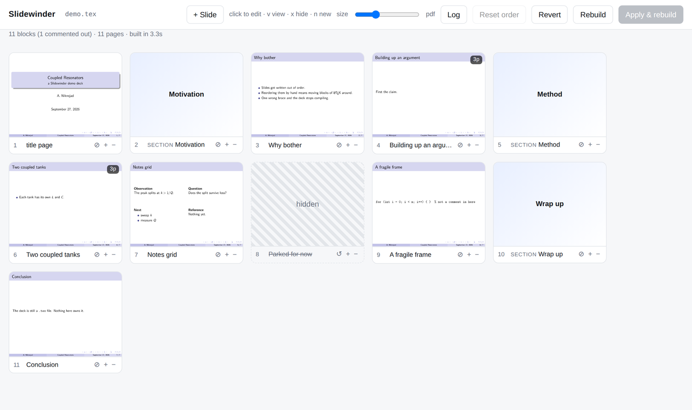
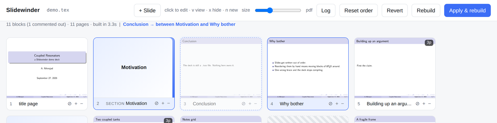
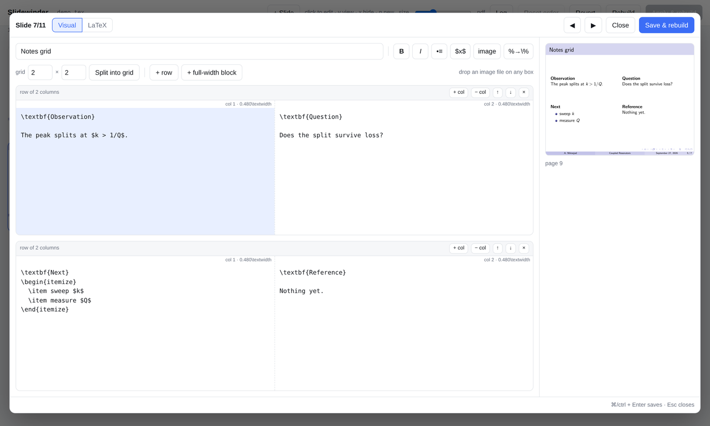

# Slidewinder

A slide sorter and visual editor for LaTeX **beamer** decks, in your browser.
Your `.tex` file stays the source of truth — Slidewinder rewrites only the
blocks you touch and leaves everything else byte for byte as you wrote it.

```
python3 slidewinder.py talk.tex
```



Drag slides into the order you want, press **Apply & rebuild**: the file is
backed up, rewritten, recompiled, and the thumbnails come back in the new
order. Click any slide to edit it.

## Why

Reordering a beamer deck by hand means cutting and pasting blocks of LaTeX and
hoping you got the braces right. Every other tool in this space wants to own
your document — a WYSIWYG canvas, a custom file format, a package you have to
load. Slidewinder doesn't. It reads your file, shows you pictures, and writes
back the smallest edit that does what you asked. Close it and you still have an
ordinary `.tex` deck that compiles anywhere.

## Install

```
git clone https://github.com/YOURNAME/slidewinder.git
cd slidewinder
./setup.sh                  # creates .venv with the PDF renderer
source .venv/bin/activate
python slidewinder.py example/demo.tex
```

Two things live outside Python:

- **A LaTeX engine** (`xelatex` by default) — a TeX distribution, so it cannot
  come from pip. On macOS that is MacTeX (`brew install --cask mactex-no-gui`).
  Slidewinder adds `/Library/TeX/texbin`, homebrew and MacPorts to `PATH`
  itself, so an un-sourced shell is not a problem.
- **A PDF page renderer** — poppler's `pdftoppm` if you have it, otherwise
  `pypdfium2`, which is a plain pip wheel. That is all `setup.sh` installs, so
  no homebrew is required.

```
python slidewinder.py --check      # says exactly what is found and what is missing
```

Slidewinder itself is standard library only, Python 3.8+. One file, no server,
no account, nothing leaves your machine.

## The sorter

Each card is one *block* of the document body:

- a `\begin{frame} ... \end{frame}` environment (or an old-style `\frame{...}`)
- a `\section{...}` command (`--no-sections` to ignore them, `--subsections` to
  include those too)

Everything else — the preamble, `\input` lines, stray text and comments between
frames — stays anchored where it is. Reordering permutes the blocks among the
slots they already occupy, so the material between two frames does not travel
with them.

A frame that spans several PDF pages (`\pause`, `<1->` overlays) is one card
showing its first page with a page-count badge. Double-click to page through it
full size.

**While you drag**, the card you are moving turns dashed, the two cards it will
land between are outlined on the facing edges, and the status line spells it
out:



## The editor

Click any slide. The rendered page sits beside the text so you can see what you
are changing; **Save & rebuild** (⌘/ctrl+Enter) writes, recompiles and refreshes
the preview without closing.



**Visual** gives you a title field and one box per region of the slide, with a
toolbar that inserts what you would otherwise have to remember:

| button | does |
| --- | --- |
| **B** / *I* | `\textbf{…}` / `\emph{…}` around the selection |
| •≡ | turns the selected lines into an `itemize` list, or starts an empty one |
| $x$ | wraps the selection in math |
| image | opens the image picker |
| %→\\% | escapes `% & # _` in the selection — the fix for a stray `%` eating a line |

**LaTeX** shows the whole frame's source. Switching to it shows exactly what
the visual view will write; switching back re-parses, so hand-written LaTeX
survives the round trip and stays editable in boxes afterwards.

◀ ▶ step through the deck without leaving the editor.

## Rows and columns

Set *rows × columns* and press **Split into grid**. The slide becomes that many
`columns` environments and whatever was on it lands in the first cell — nothing
is thrown away.

```latex
\begin{frame}[t]{Notes}
\begin{columns}[T]
\begin{column}{0.480\textwidth}
  ...cell...
\end{column}
\begin{column}{0.480\textwidth}
  ...cell...
\end{column}
\end{columns}

\vfill

\begin{columns}[T]
  ...
\end{columns}
\end{frame}
```

Each row has **+ col**, **− col**, ↑, ↓ and ×; **+ row** and **+ full-width
block** add more. Widths are recomputed to fit (`0.96/n` of the text width) and
rows are separated by `\vfill`, so they spread down the slide — change that in
the LaTeX tab if you want them packed.

The `[t]` on the frame and `[T]` on the columns are both load-bearing. Beamer
centres a frame's content vertically, and `columns[t]` aligns *baselines*, which
makes the block almost all depth — so a grid written that way sinks down the
slide with a band of blank space above it. `[T]` aligns the tops of the cells
and the frame's `[t]` puts the block where you expect. If a frame already
specifies `c`, `b` or `s`, that choice is left alone.

Decks not made here work too: any frame already built from `columns`, in the
long `\begin{column}{…}` or short `\column{…}` form, comes apart into the same
boxes.

## Images

The **image** button lists every image near your `.tex` — png, jpg, pdf, svg
and friends, four folders deep, newest first, with thumbnails — and inserts

```latex
\includegraphics[width=\linewidth]{figures/whatever.png}
```

**Drag a file from your file manager onto any box** and it is copied into a
`figures/` folder beside the deck and referenced the same way. Screenshot to
slide in one motion.

## Commenting slides out

⊘ (or `x`) comments a block out instead of deleting it: every line gets a
leading `%` on the next save. The card stays in place, dimmed and struck
through, so the slide keeps its position in the deck and stops being compiled.
↺ removes exactly the `%` that was added — the round trip is byte-identical.

Blocks that are already commented out are found on load, including ones you
commented out by hand. A run of comment lines counts as a hidden block when,
with one layer of `%` removed, it parses as a frame or section and nothing else
shares its lines — so `% \section{Intro} goes here` is left alone.

A hidden frame is no longer in the PDF, so Slidewinder shows the thumbnail it
had the last time it was compiled (cached by a hash of the block's text).

## Adding and deleting

**+** on a card (or `n`) inserts a slide after it and opens the editor on it;
**+ Slide** with nothing selected puts one at the front. The template is

```latex
\begin{frame}{New slide}
  % add content here
\end{frame}
```

Put your own in `.slidewinder/<name>/newslide.tex` to change it. **−** (or the
Delete key) removes a slide after a confirm.

## Keyboard

| key | action |
| --- | --- |
| click | open the editor on that slide |
| double-click | view the rendered slide full size |
| ← → | select previous / next card |
| shift (or ⌘/ctrl) + ← → | move the selected card |
| e or Enter | edit the selected slide |
| v | view it full size |
| x | comment it out, or back in |
| n | insert a new slide after it |
| Delete | delete it (asks first) |
| ⌘/ctrl + Enter | save the editor; Esc closes it |

## How it knows which page is which frame

Your file is never compiled directly. Slidewinder writes an instrumented copy
with a `\bsblk{n}` marker before every block and a shipout hook in the preamble:

```latex
\usepackage{atbegshi}
\AtBeginShipout{\immediate\write\bs@out{\thebsblk}}
```

That logs the current marker once per shipped page, in page order, so line *k*
of the map names the block that produced page *k*. It is exact for overlays and
for the frames beamer generates itself from `\AtBeginSection`. If the map and
the PDF ever disagree, the status bar says so; `-v` prints the whole map on
every build.

## Files it writes

Beside your `.tex`, under `.slidewinder/<name of the .tex>/` — one work area per
file, so two decks in a folder never share anything:

```
.slidewinder/talk/build/      instrumented copy, PDF, aux files, LaTeX log
.slidewinder/talk/thumbs/     grid thumbnails
.slidewinder/talk/pages/      full-size renders, on demand
.slidewinder/talk/cache/      last-known thumbnail per block
.slidewinder/talk/imgcache/   thumbnails for PDF figures
.slidewinder/talk/backups/    talk.tex.YYYYmmdd-HHMMSS.bak, one per write
.slidewinder/talk/newslide.tex   your template for inserted slides (optional)
```

Every write — reorder, hide, edit, insert, delete — makes a backup first, and
**Revert** restores the newest one. Images you drag in go to `figures/` beside
the deck, not into `.slidewinder/`.

## Options

```
    --check       report on engine / renderer availability and exit
-p, --port N      port (default 8737)
    --host H      bind address (default 127.0.0.1)
    --engine E    xelatex (default), pdflatex, lualatex
    --passes N    LaTeX passes per build (default 2, for TOC/refs)
    --width N     thumbnail render width in px (default 640)
    --renderer R  force auto (default), pdftoppm, or pypdfium2
    --no-sections do not treat \section as movable
    --subsections also treat \subsection as movable
    --no-open     do not open a browser
-v, --verbose     print the page map and HTTP requests
```

## How it compares

- **[BeamerPoint](https://github.com/BeamerPoint/BeamerPoint.github.io)** — a
  full WYSIWYG canvas with TeX Live compiled to WebAssembly. Much more
  ambitious, and it owns the document; Slidewinder edits the file you already
  have.
- **[BEd](https://pypi.org/project/bed-latex/)** — a Qt editor for placing
  images, text blocks and arrows on a slide. Needs its own `bed` LaTeX package
  in your document, and has no sorter.
- **LyX** — WYSIWYM with beamer support, its own `.lyx` format, an outline tree
  rather than thumbnails.
- **Overleaf, TeXstudio, Texifier, VS Code** — source editor plus PDF preview
  plus an outline. None of them let you drag thumbnails and write the result
  back.

## Caveats

- Blocks only come from the file you open; frames inside `\input`ed files are
  compiled but not movable.
- `[fragile]` frames must not contain `\begin{frame}` or `\end{frame}` inside a
  verbatim environment — that breaks beamer itself, not just this tool.
- Comments sitting between two frames stay put rather than moving with the
  frame below.
- Saving from the visual tab normalises that frame's indentation.
- If a build fails the cards fall back to their cached thumbnails and the LaTeX
  log tail is shown at the bottom of the page (**Log** toggles it).

## License

MIT — see [LICENSE](LICENSE).
